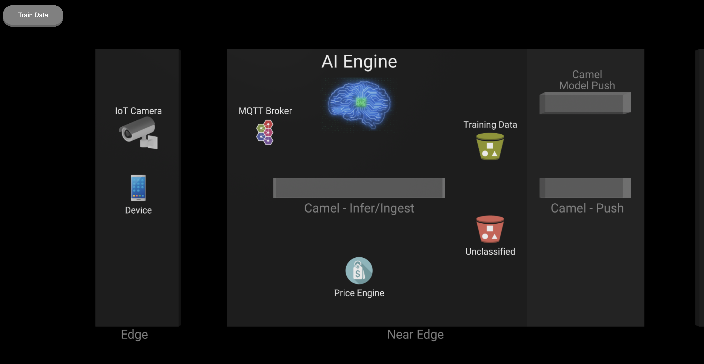

# Solution Pattern: Edge-to-Core Data Pipelines for AI/ML

本プロジェクトは、[このプロジェクト](https://github.com/brunoNetId/sp-edge-to-cloud-data-pipelines-demo)のforkです。

本プロジェクトでは、AI/MLの実装における、エッジからコアへのデータ・パイプラインのソリューション・パターンを提供します。
具体的には、エッジ・デバイスが画像データを生成し、コア・データセンターやクラウドでAI/MLモデルのトレーニングを実行する前に、エッジでデータを収集・処理・保存する必要があるシナリオにおけるアーキテクチャ・ソリューションを提供します。

このソリューション・パターンには、トレーニング・データを取得し、新しいMLモデルをトレーニングし、それらをエッジへデプロイして提供し、クライアントが推論リクエストを送信するためのサービスを公開する、データの一連の動きを示すリソースが含まれています。

# 参考サイト

このデモの全容を知るには、ソリューション・パターンのホームページをご覧ください。以下のリンクからご覧いただけます。

- [**Solution Pattern Home Page**](https://redhat-solution-patterns.github.io/solution-pattern-edge-to-cloud-pipelines/solution-pattern-edge-to-core-pipelines/index.html)


# テスト済みの構成

* RH OpenShift 4.12.12
* RHODF 4.12.11 provided by Red Hat
* RHOAI 2.8.0 provided by Red Hat
* RHO Pipelines 1.10.4 provided by Red Hat
* AMQ-Streams 2.6.0-1 provided by Red Hat
* AMQ Broker 7.11.6 provided by Red Hat
* Red Hat build of Apache Camel 4
* Camel K 1.10.6 provided by Red Hat
* RH Service Interconnect 1.4.4-rh-1 provided by Red Hat


# デプロイ手順
## 1. OpenShift環境のプロビジョニング

1. RHDSにて[**Solution Pattern - Edge to Core Data Pipelines for AI/ML**](https://demo.redhat.com/catalog?item=babylon-catalog-prod/community-content.com-edge-to-core.prod&utm_source=webapp&utm_medium=share-link)をデプロイする
2. RHDS にアクセスできない場合、OpenShift 環境が最低限利用可能であることを確認し、前提条件となる製品バージョンを満たして Red Hat OpenShift AI をインストールします (製品バージョンを調べるには、「_Tested with_」セクションを参照してください)。


## 2. ソリューションパターンのデプロイ

以降の手順は、以下の環境が存在することを前提としています。

* ローカル環境に _Docker_、_Podman_、または`ansible-playbook`がインストールされている。
* RHDSを使用してOCPクラスタ（OCP 4.12 + RHOAI 2.8でテスト済み）をプロビジョニングし、bastionサーバが利用可能である。

<br/>


## 3. デモのインストール

### 3-1. GitHubリポジトリをclone

```sh
git clone https://github.com/brunoNetId/sp-edge-to-cloud-data-pipelines-demo.git
```

### 3-2. プロジェクトのrootディレクトリへcd

```sh
cd sp-edge-to-cloud-data-pipelines-demo
```

### 3-3. _Docker_ または _Podman_ が動作している場合
**3-3-1. `KUBECONFIG` ファイルを構成する (OpenShiftクラスタへログイン後に kube-demo の詳細が設定されます)。**
```sh
export KUBECONFIG=./ansible/kube-demo
```

**3-3-2. OpenShift クラスタへログイン ( `oc` コマンド )**

```sh
oc login --username="admin" --server=https://(...):6443 --insecure-skip-tls-verify=true
```

> `--server` は、お使いのOpenShiftクラスタのAPIエンドポイントのURLへ置き換えてください。

**3-3-3. Ansible Playbookを実行**
*Dockerを使う場合*

```sh
docker run -i -t --rm --entrypoint /usr/local/bin/ansible-playbook \
-v $PWD:/runner \
-v $PWD/ansible/kube-demo:/home/runner/.kube/config \
quay.io/agnosticd/ee-multicloud:v0.0.11  \
./ansible/install.yaml
```

*Podmanを使う場合*

```sh
podman run -i -t --rm --entrypoint /usr/local/bin/ansible-playbook \
-v $PWD:/runner \
-v $PWD/ansible/kube-demo:/home/runner/.kube/config \
quay.io/agnosticd/ee-multicloud:v0.0.11  \
./ansible/install.yaml
```

ブラウザを開いて以下のURLへアクセスし、デモを実施できます！

*ユーザ向け画面*
```
https://[camel-edgeのRouteのURL]/
```

*講師向け画面*
```
https://[camel-edgeのRouteのURL]/admin.html
```



デモの詳細は、[**Solution Pattern Home Page**](https://redhat-solution-patterns.github.io/solution-pattern-edge-to-cloud-pipelines/solution-pattern-edge-to-core-pipelines/index.html)をご参照ください。

## (option) Ansible Playbook（ローカルマシンにインストール済み）で実行する場合

### OpenShift クラスタへログイン ( `oc` コマンド )

```sh
oc login --username="admin" --server=https://(...):6443 --insecure-skip-tls-verify=true
```

> `--server` は、お使いのOpenShiftクラスタのAPIエンドポイントのURLへ置き換えてください。

#### 以下のプロパティを設定
``` sh
TARGET_HOST="lab-user@bastion.b9ck5.sandbox1880.opentlc.com"
```

#### Ansible Playbookを実行
```sh
podman run -i -t --rm --entrypoint /usr/local/bin/ansible-playbook \
-v $PWD:/runner \
-v $PWD/ansible/kube-demo:/home/runner/.kube/config \
quay.io/agnosticd/ee-multicloud:v0.0.11  \
-i $TARGET_HOST,ansible/inventory/openshift.yaml ./ansible/install.yaml
```

## 4. エッジ環境を追加でデプロイする方法

2のインストールを行うと、デフォルトで以下のゾーンがデプロイされています。
 - `edge1`: 推論処理を行うエッジ環境
 - `central`: MLモデルを学習するコア・データセンター

<br>

本ソリューションパターンのアーキテクチャでは、下図のように、多くのエッジ環境をコア・データセンターに接続することができます：


新しい _Edge_ 環境をデプロイするために、上記と同じコマンドを使用します。ただし、以下の環境変数パラメータを追加してください。
- `-e EDGE_NAME=[your-edge-name]`

例えば、以下のパラメータ定義を使用します。
```sh no-copy
... ./ansible/install.yaml -e EDGE_NAME=zone2
```
新しい namespace `edge-zone2` が作成されると、そこへ、全ての _Edge_ アプリケーションとインテグレーションがデプロイされます。 

## 5. アンインストール

もしアンインストールしたい場合は、上記のインストールコマンドの末尾の`./install.yaml`を以下に差し替えてください。
 - `./uninstall.yaml`

## 6. Hard way
Ansibleでなく手動でインストールする場合は、[こちら](https://github.com/yd-ono/rhods-transfer-learning/tree/main)の手順を参照してください。


## おまけ① Filestashのインストール

[Filestash](https://www.filestash.app/)を使用することで、MinIO上のバケットに格納された画像ファイルを視覚的に確認することができます。

以下の手順で、Helmを用いてインストールできます。

```bash
oc project edge1
helm repo add filestash https://sebagarayco.github.io/helm-filestash
helm search repo filestash
helm install filestash filestash/filestash --namespace='edge1' --set serviceAccount.name='filestash'
oc adm policy add-scc-to-user anyuid -z filestash
oc expose service filestash -n edge1
```

FilestashのRouteへアクセスし、S3への接続設定でMinIOのエンドポイントとユーザ名、パスワードを指定すると以下のようにバケット内のデータへアクセスできます。

Routeのエンドポイントへ開き、S3の設定を行うと以下のようにバケットの中身を参照できます。


## おまけ② AKHQのインストール
[AKHQ](https://akhq.io/)は、Kafka上のTopicに書き込まれたデータを確認できるGUIツールです。以下のようにHelmからインストールできます。

```bash
oc project central
helm repo add akhq https://akhq.io/
helm inspect values akhq/akhq
helm upgrade --install akhq akhq/akhq --set secrets.akhq.connections.my-cluster-plain-text.properties.bootstrap.servers=my-cluster-kafka-bootstrap:9092
oc expose service akhq -n central
```

Routeのエンドポイントへアクセスすると、以下の画面が開きます。
